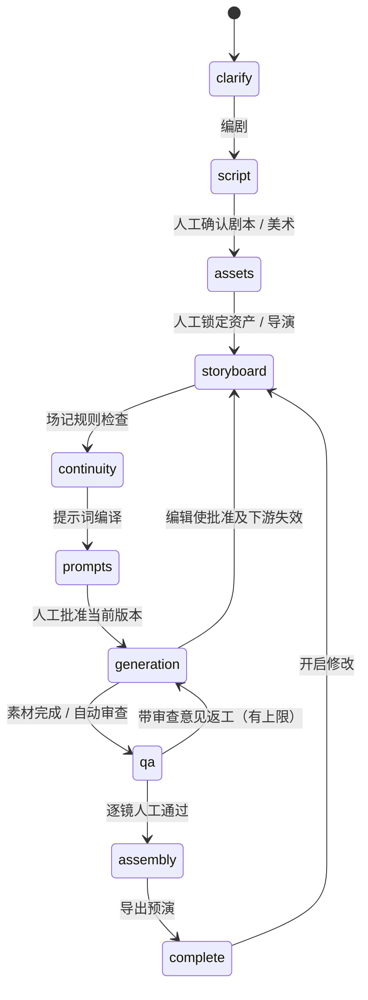

# FRAME · AI 导演工作台

从自然语言创意到剧本、角色与场景设定、分镜、可编辑运镜、连续性检查、提示词、生成队列、审片返工和动态分镜预演的本地原型。

**默认演示模式，无需 API Key，不产生模型费用。** 演示剧本来自规则模板，参考图是构图卡，导出视频是无声动态分镜预演，不是写实 AI 影片。

## 启动

需要 Node.js 24+。已安装依赖的当前目录可直接运行：

```powershell
node scripts/start.mjs
```

打开终端打印的本地地址，通常为 `http://localhost:3000/`。停止时按 Ctrl+C。

新环境先安装依赖，再启动：

```powershell
pnpm install
pnpm dev
```

如果包管理器提示依赖安装脚本需要授权，请按组织策略审核指定依赖；不要全局关闭安全检查。本原型支持从已安装依赖直接通过 Node 启动，不依赖全局 npm。

`pnpm start` 同样启动**本地开发运行时**。API 接在 Vite 本地中间件，`dist/` 构建产物不包含可独立部署的本地 API；不要将其作为生产服务发布。

## 体验完整流程

1. 新建作品，输入创意，选择片长、画幅和演示模式。
2. 阅读创意分析：模型提取已知信息，列出建议，只对影响成片的歧义提问。回答后继续检查；信息足够时确认制作简报。演示模式采用关键词规则，并明确标注。
3. 编辑并确认结构化文学剧本（人物表、内外景、地点/时间、动作、对白、声音与场末状态）；确认角色/场景设定与 Seed。旧草案可点击“重写为结构化剧本”，旧版本保留在项目历史中。
4. 编辑分镜、景别、时长、焦距、运镜路径和镜头起止状态，保存修改。
5. 运行专业场记审查，复核规则结果和模型语义意见；编译生成提示词，批准当前版本进入生成。
6. 先生成参考图，再生成片段。演示队列不调用外部服务。
7. 逐镜审片，可填写意见退回。返工同步使后续片段失效，最多两次。
8. 审片通过后生成剪辑与声音后期方案，再导出 WebM 预演。后期方案不是已完成的音频合成；导出按实际片长录制，保持页面可见。

项目保存于 `.studio/projects.json`，与浏览器缓存无关。浏览器仅存当前项目 ID。可导出完整项目 JSON 做备份，目前没有导入界面。多窗口编辑使用版本检查；本地存储是单进程串行写入，不适合多个服务进程同时访问同一数据目录。

## 状态图与角色节点



这是轻量 TypeScript 状态图，并非 LangGraph 或 MCP 的包装。创意开发、编剧、美术、导演、场记语义审查、提示词编译和后期方案在真实模式下分别调用语言模型；场记另有确定性规则；制片执行异步工具任务；审片可调用视觉网关并保留人工最终确认。每个阶段读取独立专业规范。

真实模式先提取带原文依据的已知信息，区分建议和事实，每轮最多四个关键问题。已有答案传给后续轮次，分析最多三轮；达到上限后由用户明确确认当前回答并授权补充细节，不自动假定同意。信息充分时可以零提问。资产设定集是一份项目级设定，复杂多人、多场景项目尚需扩展为带 ID 的独立资产注册表。未实现 LoRA 加载或供应商专属运动参数。

## 接入语言模型

可直接打开左侧 **服务与接入 → API 配置**，填写地址、模型 ID 与密钥，点击 **保存 API 设置**。保存立即生效，无需重启。已有密钥不回显，留空保留，勾选清除才会删除。真实生成队列运行时需要先完成或停止队列再更换配置。

界面配置保存在本机 `.studio/api-settings.json`（明文配置，已排除出 Git），优先于 `.env`，且不会包含在项目 JSON 导出中。不要分享该配置文件。切换服务商地址必须重新填写或清除对应密钥。保存成功仅确认配置写入，未进行收费 API 调用测试。新建作品时选择“真实 API”，已有演示作品保持原模式。

也可编辑本机 `.env`（新环境复制 `.env.example`），然后重启；已在界面保存的字段优先：

```dotenv
LLM_BASE_URL=https://api.deepseek.com
LLM_API_KEY=你的服务端密钥
LLM_MODEL=账户实际可用的模型ID
```

接口为 OpenAI 兼容的 `/chat/completions`，使用 JSON 输出。模型 ID 由配置指定。供应商必须支持该接口和 `response_format: {type: "json_object"}`；不兼容的供应商需扩展 `lib/studio/providers.ts`。配置存在仅代表已配置，不代表凭据或模型已经验证。

DeepSeek 协议依据：[官方首次调用文档](https://api-docs.deepseek.com/)、[Chat Completions 文档](https://api-docs.deepseek.com/api/create-chat-completion/)。Claude Code 是开发工具；Anthropic Messages API 需单独适配，不能直接当作本工作台的视频或 Chat Completions 接口。

## 图像、视频与视觉 QA

`MEDIA_GATEWAY_URL` 指向你自己的统一媒体适配网关。它**不是**可以直接填入任意 Kling / Seedance 地址的万能接口。网关负责供应商认证、模型参数、参考图模式、前镜尾帧提取和格式转换。可同样适配云端 API 或本地 ComfyUI。

配置 `QA_GATEWAY_URL`、`QA_API_KEY` 可启用真实视频输出后的视觉审查网关。拒绝结果会将意见带回下一次请求并重试，最多两次；未配置时只进行人工画面审查，绝不伪造视觉通过。

完整协议见 [媒体与审查网关](docs/media-gateway.md)。没有供应商密钥，本次未验证真实收费调用；默认全部为演示。

## 连续性与预算边界

- 所有镜头继承人物外观、服装、道具、光线、风格与负面约束。
- 同场景检查前镜结束状态与后镜开始状态，检查服装、道具、光线、动作、方向、轴线、跳切风险、速度及总时长。
- 提示词携带相机坐标、焦距、缓动、上游参考图与视频链接。Seed 和精确路径仅在供应商支持时有效。
- 镜头编辑使当前及后续素材失效；资产修改使全部素材失效。修改后重新人工批准。
- 网关接收持久化幂等键；未知提交结果的传输重试复用同一任务键。网关必须实现幂等，不应重复收费。
- 本地取消停止跟踪，**不等于取消供应商任务**；已提交的远端任务仍可能计费。
- 语言模型请求最多等待 5 分钟（包含读取完整响应），媒体网关单次请求 90 秒；浏览器写入请求等待上限 5 分 30 秒，读取请求 15 秒。读取操作不等待生成；正在写入时拒绝重复提交，不积压新任务。页面显示等待秒数，超时不会自动重新调用付费 API。关闭页面后可重新打开作品查看已保存结果；尚未实现可恢复的后台语言模型任务。
- 媒体任务跟踪上限 30 分钟；同一版本每镜每种素材最多 3 个任务，失败任务最多重试两次。尚未提供货币预算、实时价格和余额控制。
- 规则不等于审美或视觉真实性保证。前镜尾帧提取、参考图上传、LoRA、音频生成仍由网关或后续模块完成。

## 后期

界面可导出时间轴 JSON，包含片段 URL、时长、对白、环境声和转场建议。

`scripts/assemble.py` 可将已下载的本地视频规范化为同一分辨率/帧率并拼接 MP4，可加入一个预先混好的音轨。需要系统安装 FFmpeg；当前机器未检测到 FFmpeg，所以尚未进行真实合成测试。

在时间轴每个 `clips[]` 中添加 `file` 指向本地片段；可添加顶层 `audioFile`：

```powershell
python scripts/assemble.py frame-timeline.json output.mp4
```

脚本只支持硬切，不会静默忽略叠化；短片段将补末帧，长片段按镜头时长裁切。无音轨时输出无声影片。TTS、SFX、BGM 生成、自动混音、字幕、跨片段光流插帧与色彩匹配尚未实现。

## 验证与目录

```powershell
node --experimental-strip-types --test tests/*.test.ts
node node_modules/typescript/bin/tsc --noEmit
node node_modules/vinext/dist/cli.js build
```

`pnpm lint` 检查本项目业务代码；脚手架自带的未使用 UI 组件保留原样，未纳入业务 lint 范围。本次未进行浏览器交互、WebM 下载或真实供应商调用验证。

- `app/page.tsx`：中文工作台和交互状态。
- `lib/studio/graph.ts`：允许的状态转换及角色事件。
- `lib/studio/domain.ts`：数据校验、演示导演、连续性规则、提示词与失效传播。
- `lib/studio/server.ts`：本地持久化、人工确认、串行队列和反思回路。
- `lib/studio/providers.ts`：语言模型、媒体与视觉审查网关接口。
- `lib/studio/animatic.ts`：构图预演和 WebM 录制。
- `tests/studio.test.ts`：状态转换、规则、保存、版本、队列与审片测试。

页面提供可选只读 WebMCP 工具 `read_production_state`。仅在浏览器支持时注册；本次没有支持该接口的验证上下文，未声称验证成功。

## 后续优先级

1. 接入并实测一个具体视频供应商，明确首尾帧、Seed、长度、画幅等能力约束。
2. 提取首中尾帧，接多模态审片网关；建立带人工标签的质量评估样本集。
3. 将人物、场景、服装与道具拆为独立版本资产；加入镜头依赖图与局部重新生成策略。
4. 音频生成与 FFmpeg 工具服务化，支持真实整片输出。
5. 持久后台 Worker、数据库、多用户认证、费用预算及云端部署。

## 产品内专业 Skills

production-skills/ 下包含九份版本化任务规范，由 lib/studio/skills.ts 注册。它们是本应用运行时读取的制作规范，不是安装到 Codex 的工具插件。

| 文件 | 实际执行位置 |
| --- | --- |
| clarify.md | 创建作品与提交澄清回答时，模型分析创意及问答历史 |
| writer.md | 结合 screenplay.ts 的输出契约生成文学剧本 |
| assets.md | 从确认剧本提取人物、服装、道具、空间与视觉规范 |
| director.md | 按确认的场次生成镜头、运动与起止状态 |
| continuity.md | 模型生成有具体依据和修复建议的文本审查，供人工复核 |
| compiler.md | 将镜头翻译为生成提示词；执行器使用编译结果并附加权威结构约束 |
| executor.md | 随任务附带执行规范；版本批准、依赖、幂等与预算由程序强制执行 |
| reviewer.md | 传给视觉审查网关；必须读取实际素材才能作视觉判断 |
| editor.md | 生成剪辑与声音建议，时间轴仍以确认镜头为准 |

界面“服务与接入”可阅读完整规范。修改规范时应同步更新注册版本；新建或重写的作品记录规范版本。规范不会保证模型输出达到专业成片水平，仍需内容评审与真实视频验证。

文学剧本不再只有 synopsis：schemaVersion=2 包含 theme、dramaticQuestion、characters 与 scenes。对白用 afterAction 关联动作段落；可导出 Fountain 风格文本。后续导演必须引用已有 scene ID，并满足每场时长。旧数据保留；主动重写会使旧分镜和生成结果失效，并保存最近十份剧本历史。

MiniMax M 系列单独启用 reasoning_split，通过规范约束 JSON 输出并执行结构校验，不假设支持 JSON-mode 参数。

本次使用模拟 API 验证各节点契约与控制流程，未替用户重写已保存的真实作品或调用付费生成。


## OpenAI 原生文生图

在「API 设置 → OpenAI 文生图」选择「OpenAI 文生图（直接接入）」，填写独立的 OpenAI API Key 并保存。默认模型 `gpt-image-2`，也可以选择账户可用的 GPT Image 1.5 / 1 / 1 Mini。不会改写现有语言模型或视频密钥。真实作品在批准分镜后点击「生成参考图」，会直接调用官方 `POST https://api.openai.com/v1/images/generations`，每镜一张、中等质量、PNG。无须媒体网关。演示作品仍不调用真实 API。

生成图片保存在 `.studio/images`，通过仅本机可访问的图片地址显示；横版为 1536×1024、竖版为 1024×1536、方图为 1024×1024，预览可能按项目画幅裁切。本次仅实现文生图：共享角色、场景和连续性文字要求，但不向 OpenAI 传入前镜图片，也不承诺固定 Seed 或人物完全一致。图生图编辑尚未实现。

请求最多等待 5 分钟。完成的图片可从本地缓存恢复；超时或中断后的未知请求不会自动重复提交。手动重试会允许新的付费请求。未配置 OpenAI 密钥时不会自动使用其他服务的密钥。代码测试使用模拟响应，未替用户调用付费 API。

视频仍走现有自建网关协议，MiniMax 原生视频尚未接入。本地参考图在提交网关时转换为 PNG data URL；网关必须接受并按供应商要求上传这些图片，不能直接把本机路径交给云端视频服务。

接口依据：[OpenAI 官方图像生成文档](https://developers.openai.com/api/docs/guides/image-generation)。


## fal.ai 与参考资产库

1. 「API 设置」填写独立的 `FAL_API_KEY`，图像服务选择 fal.ai。保留原有 OpenAI、语言模型、视频配置；不会自动切换或提交付费生成。
2. 确认剧本后，在「角色与场景」从已保存的设定建立人物、场景、道具候选。选择候选逐张生成并人工确认。原始候选走 FLUX.2 Turbo；确认后的资产可用修改说明创建新版，单参考走 FLUX Edit，多参考走 Seedream 4.5。可在卡片勾选补充参考；三视图、表情、服装、天气变体都通过修改说明创建。
3. 只有已确认图会参与真实 fal 分镜合成。执行节点按剧本当前场次筛选人物与场景，加上道具和前镜参考图，调用 Seedream 编辑接口。超过 10 张会明确报错，不能静默丢弃参考。
4. 每个资产保存提示词、参考资产 ID、父版本、模型、生成任务、URL、确认状态。确认新版替换同一资产的旧确认版本，并使下游素材与审批失效；保存新的美术设定会归档旧资产、建立新候选。
5. fal 使用异步队列；提交结果不明不会自动重发。界面保持资产页打开时轮询，重新打开可继续跟踪。停止跟踪不代表远端停止计费。已有 request ID 可恢复跟踪；未知提交需核查供应商记录再创建重试候选。

当前限制：fal 生成图保留供应商 HTTPS 链接，尚未自动归档图片二进制；链接受 fal 保留期约束，请打开原图保存重要素材。演示模式只演示清单与审批，不生成图片。每个作品最多 80 个资产版本；同一人物的三视图是模型输出，仍需人工审核，不能保证几何或身份绝对一致。OpenAI 原生仍为文生图，视频原生 MiniMax 仍未接入。

接口依据：[FLUX Edit Schema](https://fal.ai/models/fal-ai/flux-2/turbo/edit/api)、[Seedream 编辑](https://fal.ai/models/fal-ai/bytedance/seedream/v4.5/edit)、[fal 异步队列](https://fal.ai/docs/documentation/model-apis/inference/queue)。自动化测试只使用模拟响应，不消耗真实 API 额度。


### 资产设计 3.0 与可见提示词
真实模式先由资产设计师读取剧本和美术设定，输出逐实体结构化蓝图（依据、可见设计、表现方式枚举、HEX 配色、环境光照），再编译为 JSON 提示词。不会将全局风格或人物布光原文直接传给所有图片。道具按实体提取，电话/画外音人物不默认生成外观图。蓝图格式异常最多修复一次；此步骤可能调用两次语言模型，浏览器最多等待 10 分 30 秒。

候选卡片默认显示结构化提示词、设定依据和输入参考版本，完整实际提示词可展开核对。点击“重新分析资产设计”会保留并归档旧候选，只创建新文字候选，不调用生图。旧版提示词不可继续付费提交，防止持久化旧数据绕过新规则。

确认独立主图后可建立逐张视角清单：人物正/侧/背面、面部、服装；场景全景、反向、材质；道具正面、侧面、关键部件。每个候选只生成一张图且输入已确认主图。确认细节不会替换主图，替换主图会归档旧细节。当前自动分镜合成使用确认主图，细节视角供检查与手动修改引用；尚未自动评估多视角几何一致性。


### 完整套组、服装分套与本地上传
人物套组 9 张（正侧背、面部、发型、两种表情、服装及面料细节），场景 6 张（全景、反向、入口、布局、设施、材质），道具 5 张（正侧背、俯视、部件）。先生成/上传并确认独立主图，再建立完整候选清单，每项独立生成。新增服装独立建套，审核后可明确选择用于全片分镜；道具开合等状态由用户说明创建。逐张确认后填写整套一致性意见，真实 fal 分镜生成入口会检查整套审核。套组总览由已有图片排版，不额外生图。

每个待生成候选支持本地 PNG/JPEG/WebP 上传，最大 8 MB。文件实际保存在 `.studio/images/<随机ID>.<扩展名>`，记录上传来源，上传后待确认；不能直接覆盖已完成图片，应建立新候选。上传不调用模型，后续图生图才将图片发送至已配置供应商。fal 原生生成图仍为远程链接，上传功能不会自动下载旧 fal 图片。每个作品最多保留 160 个资产版本。
